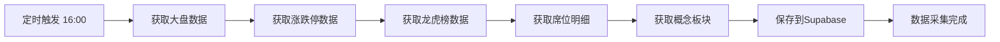

# 📊 股市短线复盘工具 - MVP 版本

一个基于 Next.js + FastAPI + Supabase 的股市每日复盘分析工具

## 🎯 核心功能

### 首页数据展示
- ✅ 大盘指数（上证、深证、创业板）
- ✅ 当日成交量统计
- ✅ 涨跌停股票数据
- ✅ 龙虎榜数据（含席位明细）
- ✅ 热门概念板块
- ✅ 自选股跟踪

## ����️ 技术栈

```
前端: Next.js 15 + TypeScript + TailwindCSS + shadcn/ui
后端: Python FastAPI
数据库: Supabase (PostgreSQL)
数据源: AKShare (免费开源)
图表: Recharts / ECharts
定时任务: APScheduler
部署: Vercel + Railway
```

## 📁 项目结构

```
短信复盘/
├── frontend/                 # Next.js 前端
│   ├── app/
│   │   ├── page.tsx         # 首页
│   │   ├── dragon-tiger/    # 龙虎榜页面
│   │   ├── concepts/        # 概念板块页面
│   │   └── watchlist/       # 自选股页面
│   ├── components/
│   │   ├── MarketOverview.tsx    # 大盘概览组件
│   │   ├── DragonTigerBoard.tsx  # 龙虎榜组件
│   │   ├── HotConcepts.tsx       # 热门板块组件
│   │   └── WatchlistStocks.tsx   # 自选股组件
│   ├── lib/
│   │   ├── supabase.ts      # Supabase 客户端
│   │   └── api.ts           # API 调用函数
│   └── package.json
│
├── backend/                  # FastAPI 后端
│   ├── main.py              # FastAPI 主应用
│   ├── routers/
│   │   ├── market.py        # 大盘数据路由
│   │   ├── dragon_tiger.py  # 龙虎榜路由
│   │   └── concepts.py      # 概念板块路由
│   ├── services/
│   │   └── data_service.py  # 数据服务层
│   ├── models/
│   │   └── schemas.py       # Pydantic 模型
│   ├── requirements.txt
│   └── .env
│
├── data-collector/           # 数据采集脚本
│   ├── data-collector.py    # 主采集脚本
│   ├── scheduler.py         # 定时任务调度
│   ├── requirements.txt
│   └── .env
│
├── database-schema.sql       # 数据库表结构
└── README.md
```

## 🚀 快速开始

### 1. 环境准备

```bash
# Python 环境
python3 --version  # 需要 Python 3.9+

# Node.js 环境
node --version  # 需要 Node.js 18+
```

### 2. Supabase 设置

1. 访问 [Supabase](https://supabase.com) 创建免费项目
2. 在 SQL Editor 中执行 `database-schema.sql`
3. 获取项目的 URL 和 API Key

### 3. 数据采集器配置

```bash
cd data-collector

# 安装依赖
pip3 install akshare supabase pandas python-dotenv apscheduler

# 配置环境变量
cat > .env << EOF
SUPABASE_URL=你的supabase项目URL
SUPABASE_KEY=你的supabase anon key
EOF

# 测试运行
python3 data-collector.py
```

### 4. 后端 API 配置

```bash
cd backend

# 安装依赖
pip3 install fastapi uvicorn supabase python-dotenv pydantic

# 配置环境变量（同上）
cp ../data-collector/.env .env

# 启动服务
uvicorn main:app --reload --port 8000
```

### 5. 前端配置

```bash
cd frontend

# 安装依赖
npm install

# 配置环境变量
cat > .env.local << EOF
NEXT_PUBLIC_SUPABASE_URL=你的supabase项目URL
NEXT_PUBLIC_SUPABASE_ANON_KEY=你的supabase anon key
NEXT_PUBLIC_API_URL=http://localhost:8000
EOF

# 启动开发服务器
npm run dev
```

访问 `http://localhost:3000` 查看效果

## ⏰ 定时任务设置

### 方式一：使用 APScheduler（推荐开发环境）

```python
# scheduler.py
from apscheduler.schedulers.blocking import BlockingScheduler
from data_collector import StockDataCollector

scheduler = BlockingScheduler()

# 每个交易日下午 4:00 执行
@scheduler.scheduled_job('cron', day_of_week='mon-fri', hour=16, minute=0)
def daily_job():
    print("开始每日数据采集...")
    collector = StockDataCollector()
    collector.collect_all_data()

if __name__ == "__main__":
    scheduler.start()
```

### 方式二：使用 Cron（推荐生产环境）

```bash
# 编辑 crontab
crontab -e

# 添加定时任务（每个工作日下午4点执行）
0 16 * * 1-5 cd /path/to/data-collector && python3 data-collector.py
```

## 📊 数据源说明

### AKShare API 使用的接口：

| 数据类型 | API 接口 | 说明 |
|---------|---------|------|
| 大盘指数 | `ak.stock_zh_index_daily()` | 获取指数历史数据 |
| 涨停板 | `ak.stock_zt_pool_em()` | 获取涨停板数据 |
| 龙虎榜 | `ak.stock_lhb_detail_em()` | 龙虎榜每日明细 |
| 席位明细 | `ak.stock_lhb_stock_detail_em()` | 个股席位详情 |
| 概念板块 | `ak.stock_board_concept_name_em()` | 概念板块数据 |
| 实时行情 | `ak.stock_zh_a_spot_em()` | A股实时行情 |

## 🎨 前端页面设计

### 首页布局
```
┌─────────────────────────────────────────┐
│  大盘概览卡片（3个指数并排）              │
├─────────────────────────────────────────┤
│  涨跌停统计 │ 成交量统计 │ 市场情绪       │
├─────────────────────────────────────────┤
│  龙虎榜数据表格（可点击查看详情）         │
├─────────────────────────────────────────┤
│  热门概念板块（热力图或柱状图）           │
├─────────────────────────────────────────┤
│  自选股行情（自定义股票列表）             │
└─────────────────────────────────────────┘
```

## 🔧 核心功能实现

### 数据采集流程



### API 端点设计

```
GET  /api/market/index          # 获取大盘指数
GET  /api/market/limit-stats    # 获取涨跌停统计
GET  /api/dragon-tiger          # 获取龙虎榜列表
GET  /api/dragon-tiger/:code    # 获取个股席位详情
GET  /api/concepts              # 获取热门概念
GET  /api/watchlist             # 获取自选股
POST /api/watchlist             # 添加自选股
DELETE /api/watchlist/:code     # 删除自选股
```

## 📈 MVP 版本路线图

- [x] 数据库设计
- [x] 数据采集脚本
- [ ] FastAPI 后端 API
- [ ] Next.js 前端页面
- [ ] 数据可视化图表
- [ ] 定时任务部署
- [ ] 生产环境部署

## 🐛 常见问题

### Q: AKShare 数据获取失败？
A:
1. 检查网络连接
2. AKShare 基于爬虫，不要频繁调用
3. 部分接口可能需要等待几秒重试

### Q: Supabase 连接失败？
A:
1. 检查 `.env` 文件配置
2. 确认 Supabase 项目 URL 和 Key 正确
3. 检查数据库表是否创建成功

### Q: 如何添加更多数据源？
A: 可以集成 Tushare Pro 作为备用数据源：
```python
import tushare as ts
pro = ts.pro_api('你的token')
df = pro.top_list(trade_date='20250207')
```

## 📝 下一步优化方向

1. ✨ 添加数据分析功能（技术指标、资金流向分析）
2. 📊 更丰富的图表展示（K线图、分时图）
3. 🔔 异动提醒功能（涨停监控、龙虎榜提醒）
4. 📱 移动端适配
5. 🤖 AI 辅助分析（基于 LLM 的市场解读）
6. 📄 生成复盘报告（PDF/Markdown）

## 📄 许可证

MIT License

## 🙏 致谢

- [AKShare](https://akshare.akfamily.xyz/) - 免费开源的金融数据接口
- [Supabase](https://supabase.com) - 开源的 Firebase 替代品
- [Next.js](https://nextjs.org/) - React 全栈框架
- [FastAPI](https://fastapi.tiangolo.com/) - 现代 Python Web 框架

---

**开发者**: 你的名字
**最后更新**: 2025-12-07
