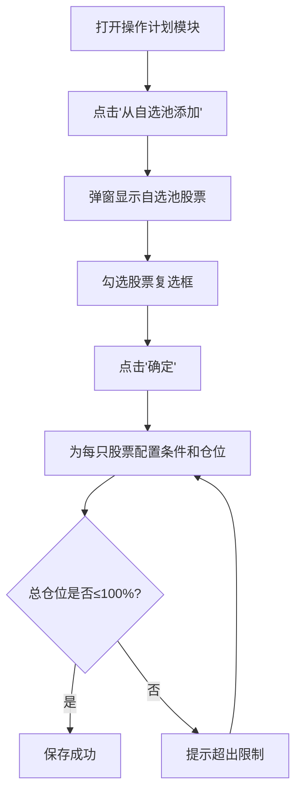
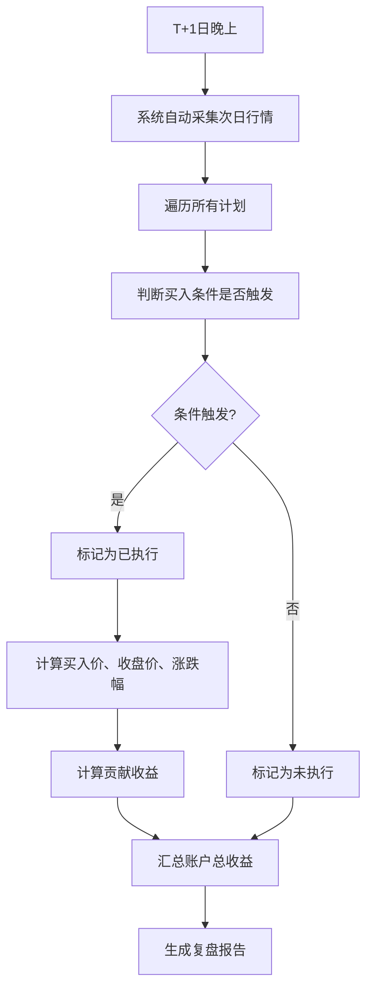

# 操作计划与复盘模块 - 需求文档

## 1. 功能概述

操作计划与复盘模块是一个模拟交易计划工具，帮助用户：
- 在收盘后制定明日操作计划
- 设置买入条件和仓位配置
- 次日自动判断条件触发情况
- 晚上复盘分析执行结果和盈亏

**核心价值**：培养交易纪律、验证策略有效性、系统性复盘

---

## 2. 业务场景

### 2.1 典型使用流程

**T日晚上（制定计划）**
1. 用户浏览自选池中的股票
2. 选择明日看好的股票
3. 为每只股票设置：
   - 买入条件（开盘价、开盘+X%、开盘-X%）
   - 仓位配置（1/1、1/2、1/3、1/4）
4. 保存操作计划

**T+1日开盘**
- 用户自行观察市场（系统不参与）

**T+1日晚上（复盘）**
1. 系统自动判断哪些计划触发了买入条件
2. 计算执行后的盈亏情况
3. 展示：
   - 已执行股票列表及收益
   - 未执行股票列表（条件未满足）
   - 账户总收益、使用仓位、执行率等统计
4. 结合大盘/板块/情绪分析，理解当日市场

---

## 3. 核心功能

### 3.1 操作计划管理

#### 3.1.1 创建计划
- **入口**：个股分析页面的"操作计划"模块
- **数据来源**：自选池股票
- **操作流程**：
  1. 从自选池选择股票（支持多选，复选框）
  2. 点击"放入操作计划"按钮
  3. 为每只股票配置：
     - 买入条件
     - 仓位比例
  4. 保存计划

#### 3.1.2 买入条件类型

| 条件类型 | 说明 | 示例 |
|---------|------|------|
| 开盘价买入 | 无条件，开盘价买入 | 开盘价14.50元，直接买入 |
| 开盘涨幅买入 | 开盘涨幅达到X%时买入 | 开盘+2%买入 |
| 开盘跌幅买入 | 开盘跌幅达到X%时买入 | 开盘-3%买入 |

#### 3.1.3 仓位配置

| 仓位选项 | 比例 | 说明 |
|---------|------|------|
| 1/1 | 100% | 满仓 |
| 1/2 | 50% | 半仓 |
| 1/3 | 33.3% | 三分之一仓 |
| 1/4 | 25% | 四分之一仓 |

**仓位限制**：
- 单日所有计划的仓位总和 ≤ 100%
- 添加时实时校验，超出限制则提示用户

#### 3.1.4 编辑和删除
- 支持修改买入条件和仓位
- 支持删除计划
- 修改时重新校验总仓位

---

### 3.2 复盘分析

#### 3.2.1 条件触发判断

**系统自动判断逻辑**（基于次日实际行情）：

| 计划条件 | 触发判断 | 示例 |
|---------|---------|------|
| 开盘价买入 | 始终触发 | ✅ 触发 |
| 开盘+2%买入 | 实际开盘涨幅 ≥ 2% | 开盘+2.5% → ✅ 触发<br>开盘+1.5% → ❌ 不触发 |
| 开盘-3%买入 | 实际开盘跌幅 ≥ 3% | 开盘-3.5% → ✅ 触发<br>开盘-2.0% → ❌ 不触发 |

#### 3.2.2 执行规则（MVP版本）

**自动执行**：
- 条件触发 = 自动算执行
- 条件不触发 = 不执行

**无人为干预**（MVP版本简化）

#### 3.2.3 盈亏计算

**单股盈亏**：
```
单股盈亏 = (收盘价 - 买入价) / 买入价 × 100%
```

**对账户贡献**：
```
贡献收益 = 单股盈亏 × 仓位比例
```

**账户总收益**：
```
账户总收益 = Σ(已执行股票的贡献收益)
```

**实际使用仓位**：
```
实际使用仓位 = Σ(已执行股票的仓位)
```

**注**：收益计算公式待与用户确认后补充具体案例

#### 3.2.4 复盘展示

**已执行股票列表**：

| 字段 | 说明 |
|-----|------|
| 股票代码 | 6位代码 |
| 股票名称 | 股票名称 |
| 计划条件 | 设置的买入条件 |
| 买入价格 | 触发时的价格（开盘价或条件价） |
| 收盘价格 | 当日收盘价 |
| 涨跌幅 | 单股涨跌幅 |
| 仓位 | 使用的仓位比例 |
| 贡献收益 | 对账户的收益贡献 |

**未执行股票列表**：

| 字段 | 说明 |
|-----|------|
| 股票代码 | 6位代码 |
| 股票名称 | 股票名称 |
| 计划条件 | 设置的买入条件 |
| 条件触发 | 是否满足条件 |
| 实际涨跌幅 | 当日涨跌幅（仅供参考） |
| 原因 | 条件未满足 |

**统计数据**：
- 账户总收益（%）
- 实际使用仓位（%）
- 计划执行率（已执行/总计划）
- 执行后胜率（盈利数/已执行数）

---

## 4. 数据模型

### 4.1 数据库表设计

**表名**：`trading_plan`

| 字段名 | 类型 | 说明 | 示例 |
|-------|------|------|------|
| id | BIGSERIAL | 主键 | 1 |
| plan_date | DATE | 计划日期（T日） | 2025-12-13 |
| stock_code | VARCHAR(10) | 股票代码 | 300265 |
| stock_name | VARCHAR(50) | 股票名称 | 通光线缆 |
| buy_condition_type | VARCHAR(20) | 买入条件类型 | open_price / open_up / open_down |
| buy_condition_value | DECIMAL(5,2) | 条件数值（涨跌幅%） | 2.00（代表+2%）<br>-3.00（代表-3%）<br>NULL（开盘价） |
| position_ratio | DECIMAL(5,4) | 仓位比例 | 0.5000（1/2）<br>0.3333（1/3）<br>0.2500（1/4）<br>1.0000（1/1） |
| is_triggered | BOOLEAN | 条件是否触发 | true / false |
| buy_price | DECIMAL(10,2) | 买入价格 | 14.50 |
| close_price | DECIMAL(10,2) | 收盘价格 | 15.80 |
| stock_change_pct | DECIMAL(6,2) | 个股涨跌幅 | 8.97 |
| contribution_pct | DECIMAL(6,2) | 对账户贡献收益 | 4.48 |
| created_at | TIMESTAMP | 创建时间 | 2025-12-13 20:30:00 |
| updated_at | TIMESTAMP | 更新时间 | 2025-12-14 20:30:00 |

**索引**：
- PRIMARY KEY (id)
- INDEX idx_plan_date (plan_date)
- INDEX idx_stock_code (stock_code)

---

## 5. 页面结构

### 5.1 个股分析页面改造

**移除**：
- ❌ "个股明日溢价概率评分"模块

**新增**：
- ✅ "明日操作计划"模块

### 5.2 操作计划模块布局

```
┌─────────────────────────────────────────────────────────┐
│ 明日操作计划                          [查看历史计划]    │
├─────────────────────────────────────────────────────────┤
│                                                          │
│ [从自选池添加] 已使用仓位：50% / 100%  剩余：50%        │
│                                                          │
│ ┌──────────────────────────────────────────────────┐   │
│ │ 股票      买入条件      仓位    操作              │   │
│ ├──────────────────────────────────────────────────┤   │
│ │ 300265   开盘价买入     1/2    [编辑] [删除]     │   │
│ │ 通光线缆                                          │   │
│ ├──────────────────────────────────────────────────┤   │
│ │ 600865   开盘+2%买入    1/4    [编辑] [删除]     │   │
│ │ 百大集团                                          │   │
│ └──────────────────────────────────────────────────┘   │
│                                                          │
│                                    [保存计划]            │
└─────────────────────────────────────────────────────────┘
```

### 5.3 复盘分析页面

```
┌─────────────────────────────────────────────────────────┐
│ 2025-12-13 交易计划复盘                                 │
├─────────────────────────────────────────────────────────┤
│                                                          │
│ 📊 总览                                                  │
│ ┌──────────┬──────────┬──────────┬──────────┐          │
│ │账户收益  │使用仓位  │执行率    │胜率      │          │
│ │+4.48%    │50%       │1/2 (50%) │1/1 (100%)│          │
│ └──────────┴──────────┴──────────┴──────────┘          │
│                                                          │
│ ✅ 已执行股票（1只）                                     │
│ ┌────────────────────────────────────────────────┐     │
│ │代码  名称  条件  买入价 收盘价 涨跌  仓位 贡献  │     │
│ ├────────────────────────────────────────────────┤     │
│ │300265 通光 开盘 14.50  15.80  +8.97% 1/2  +4.48%│    │
│ └────────────────────────────────────────────────┘     │
│                                                          │
│ ❌ 未执行股票（1只）                                     │
│ ┌────────────────────────────────────────────────┐     │
│ │代码  名称  条件      触发  涨跌   原因          │     │
│ ├────────────────────────────────────────────────┤     │
│ │600865 百大 开盘+2%   ❌否  -2.00% 条件未满足    │     │
│ └────────────────────────────────────────────────┘     │
│                                                          │
│ 💡 结合市场分析                                          │
│ ├─ [查看当日大盘分析]                                   │
│ ├─ [查看当日板块分析]                                   │
│ └─ [查看当日情绪分析]                                   │
│                                                          │
└─────────────────────────────────────────────────────────┘
```

---

## 6. 业务流程

### 6.1 制定计划流程



### 6.2 复盘流程



---

## 7. MVP版本范围

### 7.1 包含功能

✅ 创建操作计划
✅ 设置买入条件（开盘价、开盘±X%）
✅ 设置仓位（1/1、1/2、1/3、1/4）
✅ 仓位总和校验（≤100%）
✅ 自动判断条件触发
✅ 自动执行（条件触发=执行）
✅ 盈亏计算
✅ 复盘报告展示
✅ 基础统计（总收益、使用仓位、执行率、胜率）

### 7.2 暂不包含（后续迭代）

❌ 人为标记是否执行
❌ 执行失败原因记录
❌ 止损止盈设置
❌ 历史计划统计分析
❌ 策略回测（基于历史计划）
❌ 计划模板功能
❌ 自选池管理功能（依赖已有模块）

---

## 8. 接口设计（API）

### 8.1 创建操作计划

**POST** `/api/trading-plan/create`

**请求体**：
```json
{
  "plan_date": "2025-12-13",
  "stocks": [
    {
      "stock_code": "300265",
      "stock_name": "通光线缆",
      "buy_condition_type": "open_price",
      "buy_condition_value": null,
      "position_ratio": 0.5
    },
    {
      "stock_code": "600865",
      "stock_name": "百大集团",
      "buy_condition_type": "open_up",
      "buy_condition_value": 2.0,
      "position_ratio": 0.25
    }
  ]
}
```

**响应**：
```json
{
  "success": true,
  "message": "操作计划创建成功",
  "total_position": 0.75
}
```

### 8.2 查询操作计划

**GET** `/api/trading-plan/list?plan_date=2025-12-13`

**响应**：
```json
{
  "success": true,
  "data": {
    "plan_date": "2025-12-13",
    "total_position": 0.75,
    "plans": [
      {
        "id": 1,
        "stock_code": "300265",
        "stock_name": "通光线缆",
        "buy_condition_type": "open_price",
        "buy_condition_value": null,
        "position_ratio": 0.5
      }
    ]
  }
}
```

### 8.3 执行复盘

**POST** `/api/trading-plan/backtest?plan_date=2025-12-13`

**功能**：
- 查询计划股票次日行情
- 判断条件触发
- 计算盈亏
- 更新数据库

**响应**：
```json
{
  "success": true,
  "data": {
    "summary": {
      "total_return": 4.48,
      "used_position": 0.5,
      "execution_rate": 0.5,
      "win_rate": 1.0
    },
    "executed": [
      {
        "stock_code": "300265",
        "stock_name": "通光线缆",
        "buy_price": 14.50,
        "close_price": 15.80,
        "change_pct": 8.97,
        "position_ratio": 0.5,
        "contribution": 4.48
      }
    ],
    "not_executed": [
      {
        "stock_code": "600865",
        "stock_name": "百大集团",
        "condition": "开盘+2%买入",
        "is_triggered": false,
        "change_pct": -2.0,
        "reason": "条件未满足"
      }
    ]
  }
}
```

### 8.4 删除计划

**DELETE** `/api/trading-plan/delete?id=1`

**响应**：
```json
{
  "success": true,
  "message": "删除成功"
}
```

---

## 9. 技术实现要点

### 9.1 数据来源

**计划创建时**：
- 自选池股票列表（假设已有接口）

**复盘时**：
- 次日股票行情数据（从 `limit_stocks_detail` 表或日线数据表）
- 开盘价、收盘价、涨跌幅

### 9.2 关键逻辑

**仓位校验**：
```python
def validate_position(plans: List[Plan]) -> bool:
    total = sum(p.position_ratio for p in plans)
    return total <= 1.0
```

**条件触发判断**：
```python
def is_triggered(plan: Plan, open_change_pct: float) -> bool:
    if plan.buy_condition_type == 'open_price':
        return True
    elif plan.buy_condition_type == 'open_up':
        return open_change_pct >= plan.buy_condition_value
    elif plan.buy_condition_type == 'open_down':
        return open_change_pct <= -plan.buy_condition_value
    return False
```

**收益计算**：
```python
def calculate_contribution(
    buy_price: float,
    close_price: float,
    position_ratio: float
) -> float:
    change_pct = (close_price - buy_price) / buy_price * 100
    contribution = change_pct * position_ratio
    return contribution
```

---

## 10. 待确认事项

### 10.1 收益计算公式

**待确认**：账户总收益的具体计算方式

**当前理解**：
```
贡献收益 = 单股涨跌幅 × 仓位比例
账户总收益 = Σ(已执行股票的贡献收益)
```

**示例**：
- 通光线缆：涨8.97%，仓位50%
- 贡献收益 = 8.97% × 50% = 4.485%
- 账户总收益 = 4.485%

**用户反馈**：应该是 2.24%？

**待澄清**：是否需要再除以某个系数？

### 10.2 自选池功能

**假设**：系统已有自选池功能和相关接口

**如果没有**：需要先开发自选池管理模块

---

## 11. 后续迭代方向

### V2.0 功能
- 人为标记执行/未执行
- 执行失败原因记录
- 历史计划查询和统计

### V3.0 功能
- 止损止盈设置
- 策略回测分析
- 计划模板功能

### V4.0 功能
- 多策略对比
- 执行建议推荐
- 交易日志导出

---

## 12. 验收标准

### 功能验收
- [ ] 可以从自选池添加股票到操作计划
- [ ] 可以设置买入条件和仓位
- [ ] 仓位总和超过100%时有提示
- [ ] 次日可以查看复盘报告
- [ ] 复盘报告正确区分已执行/未执行
- [ ] 收益计算准确
- [ ] 统计数据正确

### 性能验收
- [ ] 计划列表加载时间 < 1秒
- [ ] 复盘计算时间 < 2秒

### 体验验收
- [ ] 界面清晰，操作流畅
- [ ] 数据展示易读
- [ ] 错误提示友好

---

## 文档版本

| 版本 | 日期 | 修改人 | 说明 |
|-----|------|--------|------|
| v1.0 | 2025-12-13 | Claude | 初始版本 |

---

**备注**：
- 本文档为MVP版本需求，重点在于快速验证核心功能
- 收益计算公式待与用户确认后补充完善
- 自选池功能假设已存在，如无需先开发
